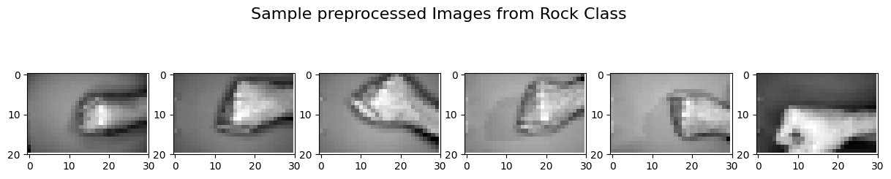

# DWS-101-ML-Project

## Project Objective: Intelligent Agent for Rock-Scissor-Paper Game

The goal of this project is to develop an intelligent agent capable of learning to play the Rock-Scissor-Paper game. Specifically, the agent has to be able to recognize an image representing one of the available moves (Rock, Scissor, Paper) and autonomously select the corresponding move that beats the observed one. In this project, several machine learning models were employed in order to assess their performance in this task and select the best one. All models were trained on a [dataset](https://www.kaggle.com/datasets/drgfreeman/rockpaperscissors) that has been obtained from Kaggle and contains images of hand gestures from the Rock-Paper-Scissors game. 

## Dataset samples
In order to facilitate the training process of the agent, the initial dataset was preprocessed so as all images to be in the shape of (width: 30, height: 20, dim: 1) in gray scale. 
Some indicatinve examples of the preprocessed dataset are presented below:

