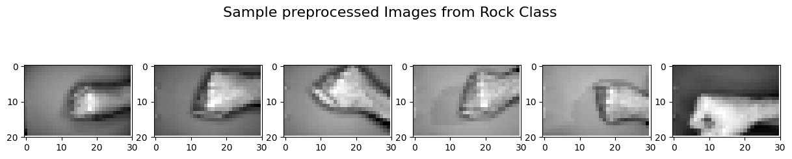
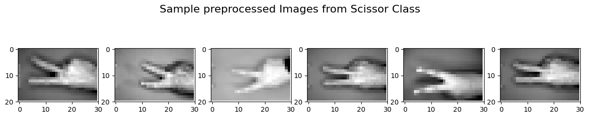
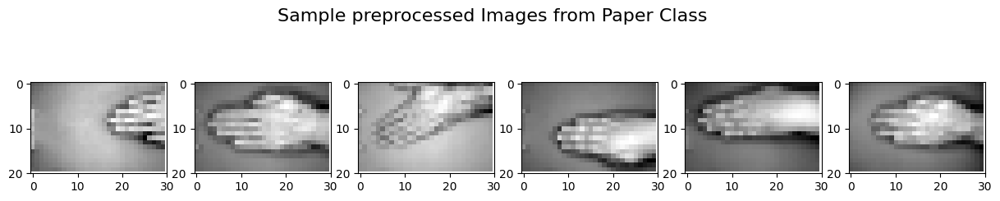
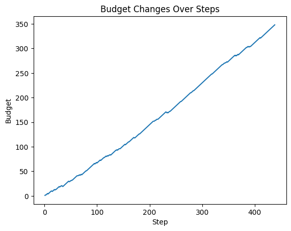

# DWS-101-ML-Project

## Project Objective: Intelligent Agent for Rock-Scissor-Paper Game

The goal of this project is to develop an intelligent agent capable of learning to play the Rock-Scissor-Paper (RSP) game. Specifically, the RSP agent has to be able to recognize an image representing one of the available moves (Rock, Scissor, Paper) and autonomously select the corresponding move that beats the observed one. In this project, several machine learning models were employed in order to assess their performance in this task and select the best one. All models were trained on a [dataset](https://www.kaggle.com/datasets/drgfreeman/rockpaperscissors) that has been obtained from Kaggle and contains images of hand gestures from the Rock-Paper-Scissors game. 

## Dataset samples
In order to facilitate the training process of the RSP agent, the initial dataset was preprocessed so that all images are in the shape of (width: 30, height: 20, dim: 1) in grayscale. 
Some indicative examples of the preprocessed dataset are presented below:

## Implementation 

For the implementation of the RSP agent three different models were employed:

- **Random Forest**: The decision to employ a Random Forest model for RSP agent was motivated by the versatility and simplicity of such models. Random Forests are an ensemble learning method that combines the predictions of multiple decision trees, offering robustness against overfitting and high interpretability.

- **MLP**: The decision to use a Multi-Layer Perceptron (MLP) for RSP agent was driven by the simplicity and ease of implementation offered by MLPs, making them a suitable choice for experimentation and initial exploration. MLPs are a foundational type of neural network that can handle various tasks, including classification. 

- **Convolutional Neural Netowork**: A Convolutional Neural Network (CNN) architecture were employed to represent the RSP agent due to their effective design for image classification tasks. 

After the experimentation with all these models CNN model achieved better performance in image recognition in all cases. Therefore, this is the base model for the RSP agent.

## Results
The RSP agent plays against a Random agent that is always selecting first an image. The Random agent can apply vertical or horizontal flips in 0.5 probability, while adding some noise to the image. In each turn of the game, the RSP agent bets 1 euro. If it wins it gets back 2 euros, in draw it gets back its bet and in loss it gets back nothing. The chart below presents the RSP agent budget changes while playing on the test set of the initial dataset.

